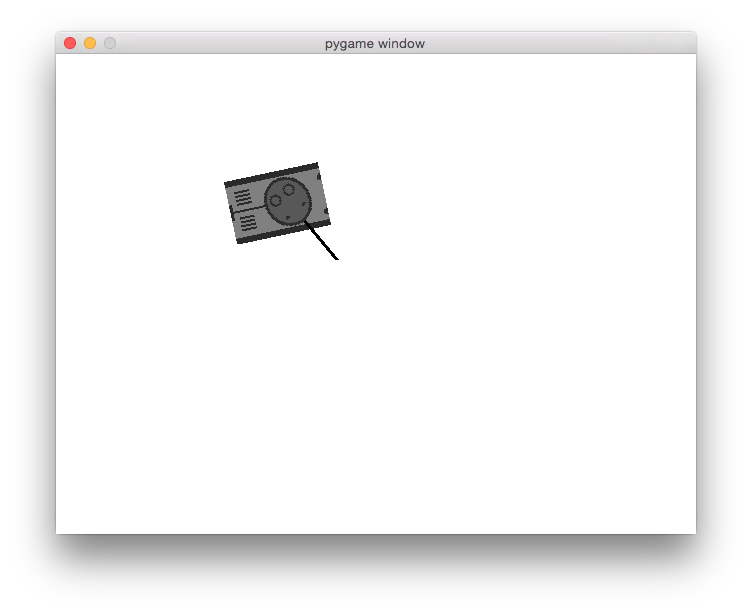

# Tanks
A top-down tank pygame

Just a simple tank game, using Pygame. If you're not familiar, Pygame is essentially an under-supported SDL wrapper for Python.

Make sure to run with Python 2.7 and Pygame and Pygame dependencies installed.

###Controls:
- WASD to move the tank
- Space to fire the gun
- Enter to toggle fullscreen
- Escape to leave the game

